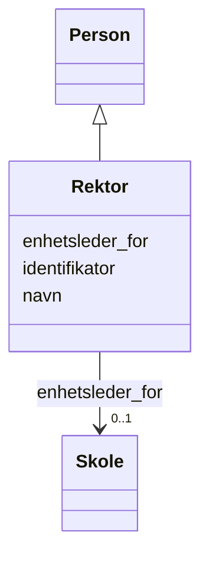

# Class: Rektor 


_Høgaste akademiske leder av en skole_


URI: [samtbuskole:Rektor](https://example.no/ontology/skole#Rektor)





## Inheritance
* [Person](person.md)
    * **Rektor**


## Eigenskapar


  
  


  
  


  
  


  
  
  
  
    
  


### Andre

| Namn | Kardinalitet og domene | Beskriving |
| --- | --- | --- |
| [enhetsleder_for](enhetsleder_for.md) | 0..1 <br/> [Skole](skole.md) | Enhet rektor er enhetsleder for |


### Arva

| Namn | Kardinalitet og domene | Beskriving | Frå |
| --- | --- | --- | --- || [identifikator](identifikator.md) | 1 <br/> [Uriorcurie](uriorcurie.md) | Global identifikator (CURIE/URI) | [Person](person.md) |
| [navn](navn.md) | 0..1 <br/> [String](string.md) | Namn på ressursen | [Person](person.md) |


## Usages

| used by | used in | type | used |
| ---  | --- | --- | --- |
| [Containerklasse](containerklasse.md) | [rektorer](rektorer.md) | range | [Rektor](rektor.md) |
| [Rektor](rektor.md) | [enhetsleder_for](enhetsleder_for.md) | domain | [Rektor](rektor.md) |


## Identifier and Mapping Information


### Schema Source


* from schema: https://example.no/ontology/samt-bu-skole


## Mappings

| Mapping Type | Mapped Value |
| ---  | ---  |
| self | samtbuskole:Rektor |
| native | samtbuskole:Rektor |


## LinkML Source

<!-- TODO: investigate https://stackoverflow.com/questions/37606292/how-to-create-tabbed-code-blocks-in-mkdocs-or-sphinx -->

### Direct

<details>
```yaml
name: Rektor
description: Høgaste akademiske leder av en skole
from_schema: https://example.no/ontology/samt-bu-skole
is_a: Person
slots:
- enhetsleder_for

```
</details>

### Induced

<details>
```yaml
name: Rektor
description: Høgaste akademiske leder av en skole
from_schema: https://example.no/ontology/samt-bu-skole
is_a: Person
attributes:
  enhetsleder_for:
    name: enhetsleder_for
    description: Enhet rektor er enhetsleder for
    from_schema: https://example.no/ontology/samt-bu-skole
    close_mappings:
    - org:headOf
    rank: 1000
    domain: Rektor
    alias: enhetsleder_for
    owner: Rektor
    domain_of:
    - Rektor
    range: Skole
  identifikator:
    name: identifikator
    description: Global identifikator (CURIE/URI).
    from_schema: https://example.no/ontology/samt-bu-skole
    rank: 1000
    identifier: true
    alias: identifikator
    owner: Rektor
    domain_of:
    - Containerklasse
    - Skole
    - Skoleeier
    - Basisgruppe
    - Person
    range: uriorcurie
    required: true
  navn:
    name: navn
    description: Namn på ressursen.
    from_schema: https://example.no/ontology/samt-bu-skole
    rank: 1000
    alias: navn
    owner: Rektor
    domain_of:
    - Skole
    - Skoleeier
    - Basisgruppe
    - Person
    range: string

```
</details>