# Class: SamtBuContainer 


_Containerklasse for alle klasser som kan inngå i datasettet._


URI: [samtbuskole:SamtBuContainer](https://example.no/ontology/skole#SamtBuContainer)

```mermaid
 classDiagram
    class SamtBuContainer
    click SamtBuContainer href "../SamtBuContainer/"
      SamtBuContainer : basisgrupper
        
          
    
        
        
        SamtBuContainer --> "*" Basisgruppe : basisgrupper
        click Basisgruppe href "../Basisgruppe/"
    

        
      SamtBuContainer : brukertilbakemeldinger
        
          
    
        
        
        SamtBuContainer --> "*" Brukartilbakemelding : brukertilbakemeldinger
        click Brukartilbakemelding href "../Brukartilbakemelding/"
    

        
      SamtBuContainer : dataset_metadata
        
          
    
        
        
        SamtBuContainer --> "*" Datasett : dataset_metadata
        click Datasett href "../Datasett/"
    

        
      SamtBuContainer : datasettdistribusjoner
        
          
    
        
        
        SamtBuContainer --> "*" Distribusjon : datasettdistribusjoner
        click Distribusjon href "../Distribusjon/"
    

        
      SamtBuContainer : elever
        
          
    
        
        
        SamtBuContainer --> "*" Elev : elever
        click Elev href "../Elev/"
    

        
      SamtBuContainer : fylker
        
          
    
        
        
        SamtBuContainer --> "*" Fylke : fylker
        click Fylke href "../Fylke/"
    

        
      SamtBuContainer : gjeldende_lovgivninger
        
          
    
        
        
        SamtBuContainer --> "*" RegulativRessurs : gjeldende_lovgivninger
        click RegulativRessurs href "../RegulativRessurs/"
    

        
      SamtBuContainer : grupper
        
          
    
        
        
        SamtBuContainer --> "*" Aktor : grupper
        click Aktor href "../Aktor/"
    

        
      SamtBuContainer : id
        
          
    
        
        
        SamtBuContainer --> "0..1" String : id
        click String href "../http://www.w3.org/2001/XMLSchema#string/"
    

        
      SamtBuContainer : kommuner
        
          
    
        
        
        SamtBuContainer --> "*" Kommune : kommuner
        click Kommune href "../Kommune/"
    

        
      SamtBuContainer : kontaktlaerere
        
          
    
        
        
        SamtBuContainer --> "*" Kontaktlaerer : kontaktlaerere
        click Kontaktlaerer href "../Kontaktlaerer/"
    

        
      SamtBuContainer : kontaktpunkter
        
          
    
        
        
        SamtBuContainer --> "*" Kontaktopplysning : kontaktpunkter
        click Kontaktopplysning href "../Kontaktopplysning/"
    

        
      SamtBuContainer : kvalitetsdimensjoner
        
          
    
        
        
        SamtBuContainer --> "*" Kvalitetsdimensjon : kvalitetsdimensjoner
        click Kvalitetsdimensjon href "../Kvalitetsdimensjon/"
    

        
      SamtBuContainer : kvalitetsmaalinger
        
          
    
        
        
        SamtBuContainer --> "*" Kvalitetsmaaling : kvalitetsmaalinger
        click Kvalitetsmaaling href "../Kvalitetsmaaling/"
    

        
      SamtBuContainer : kvalitetsmerknader
        
          
    
        
        
        SamtBuContainer --> "*" Kvalitetsmerknad : kvalitetsmerknader
        click Kvalitetsmerknad href "../Kvalitetsmerknad/"
    

        
      SamtBuContainer : organisasjoner
        
          
    
        
        
        SamtBuContainer --> "*" Aktor : organisasjoner
        click Aktor href "../Aktor/"
    

        
      SamtBuContainer : private_virksomheter
        
          
    
        
        
        SamtBuContainer --> "*" PrivatVirksomhet : private_virksomheter
        click PrivatVirksomhet href "../PrivatVirksomhet/"
    

        
      SamtBuContainer : rektorer
        
          
    
        
        
        SamtBuContainer --> "*" Rektor : rektorer
        click Rektor href "../Rektor/"
    

        
      SamtBuContainer : skoler
        
          
    
        
        
        SamtBuContainer --> "*" Skole : skoler
        click Skole href "../Skole/"
    

        
      SamtBuContainer : standarder
        
          
    
        
        
        SamtBuContainer --> "*" Standard : standarder
        click Standard href "../Standard/"
    

        
      SamtBuContainer : tekstdeler
        
          
    
        
        
        SamtBuContainer --> "*" Tekstdel : tekstdeler
        click Tekstdel href "../Tekstdel/"
    

        
      SamtBuContainer : tidsromer
        
          
    
        
        
        SamtBuContainer --> "*" Tidsrom : tidsromer
        click Tidsrom href "../Tidsrom/"
    

        
      SamtBuContainer : utgivere
        
          
    
        
        
        SamtBuContainer --> "*" Aktor : utgivere
        click Aktor href "../Aktor/"
    

        
      
```





<!-- no inheritance hierarchy -->

## Class Properties

| Property | Value |
| --- | --- |
| Tree Root | Yes |


## Eigenskapar


  
  

  
  

  
  

  
  

  
  

  
  

  
  

  
  

  
  

  
  

  
  

  
  

  
  

  
  

  
  

  
  

  
  

  
  

  
  

  
  

  
  

  
  

  
  


  
  

  
  

  
  

  
  

  
  

  
  

  
  

  
  

  
  

  
  

  
  

  
  

  
  

  
  

  
  

  
  

  
  

  
  

  
  

  
  

  
  

  
  

  
  


  
  

  
  

  
  

  
  

  
  

  
  

  
  

  
  

  
  

  
  

  
  

  
  

  
  

  
  

  
  

  
  

  
  

  
  

  
  

  
  

  
  

  
  

  
  


  
  
  
  
    
  

  
  
  
  
    
  

  
  
  
  
    
  

  
  
  
  
    
  

  
  
  
  
    
  

  
  
  
  
    
  

  
  
  
  
    
  

  
  
  
  
    
  

  
  
  
  
    
  

  
  
  
  
    
  

  
  
  
  
    
  

  
  
  
  
    
  

  
  
  
  
    
  

  
  
  
  
    
  

  
  
  
  
    
  

  
  
  
  
    
  

  
  
  
  
    
  

  
  
  
  
    
  

  
  
  
  
    
  

  
  
  
  
    
  

  
  
  
  
    
  

  
  
  
  
    
  

  
  
  
  
    
  


### Andre

| Namn | Kardinalitet og domene | Beskriving |
| --- | --- | --- |
| [kontaktpunkter](kontaktpunkter.md) | * <br/> [Kontaktopplysning](kontaktopplysning.md) |  |
| [utgivere](utgivere.md) | * <br/> [Aktor](aktor.md) |  |
| [organisasjoner](organisasjoner.md) | * <br/> [Aktor](aktor.md) |  |
| [gjeldende_lovgivninger](gjeldende_lovgivninger.md) | * <br/> [RegulativRessurs](regulativressurs.md) |  |
| [datasettdistribusjoner](datasettdistribusjoner.md) | * <br/> [Distribusjon](distribusjon.md) |  |
| [dataset_metadata](dataset_metadata.md) | * <br/> [Datasett](datasett.md) |  |
| [kvalitetsmerknader](kvalitetsmerknader.md) | * <br/> [Kvalitetsmerknad](kvalitetsmerknad.md) |  |
| [brukertilbakemeldinger](brukertilbakemeldinger.md) | * <br/> [Brukartilbakemelding](brukartilbakemelding.md) |  |
| [kvalitetsmaalinger](kvalitetsmaalinger.md) | * <br/> [Kvalitetsmaaling](kvalitetsmaaling.md) |  |
| [grupper](grupper.md) | * <br/> [Aktor](aktor.md) |  |
| [standarder](standarder.md) | * <br/> [Standard](standard.md) |  |
| [kvalitetsdimensjoner](kvalitetsdimensjoner.md) | * <br/> [Kvalitetsdimensjon](kvalitetsdimensjon.md) |  |
| [tidsromer](tidsromer.md) | * <br/> [Tidsrom](tidsrom.md) |  |
| [tekstdeler](tekstdeler.md) | * <br/> [Tekstdel](tekstdel.md) |  |
| [id](id.md) | 0..1 <br/> [xsd:string](http://www.w3.org/2001/XMLSchema#string) |  |
| [skoler](skoler.md) | * <br/> [Skole](skole.md) |  |
| [kommuner](kommuner.md) | * <br/> [Kommune](kommune.md) |  |
| [fylker](fylker.md) | * <br/> [Fylke](fylke.md) |  |
| [private_virksomheter](private_virksomheter.md) | * <br/> [PrivatVirksomhet](privatvirksomhet.md) |  |
| [basisgrupper](basisgrupper.md) | * <br/> [Basisgruppe](basisgruppe.md) |  |
| [elever](elever.md) | * <br/> [Elev](elev.md) |  |
| [rektorer](rektorer.md) | * <br/> [Rektor](rektor.md) |  |
| [kontaktlaerere](kontaktlaerere.md) | * <br/> [Kontaktlaerer](kontaktlaerer.md) |  |


## Identifier and Mapping Information


### Schema Source


* from schema: https://example.no/ontology/samt-bu-skole


## Mappings

| Mapping Type | Mapped Value |
| ---  | ---  |
| self | samtbuskole:SamtBuContainer |
| native | samtbuskole:SamtBuContainer |


## LinkML Source

<!-- TODO: investigate https://stackoverflow.com/questions/37606292/how-to-create-tabbed-code-blocks-in-mkdocs-or-sphinx -->

### Direct

<details>
```yaml
name: SamtBuContainer
description: Containerklasse for alle klasser som kan inngå i datasettet.
from_schema: https://example.no/ontology/samt-bu-skole
rank: 1000
attributes:
  kontaktpunkter:
    name: kontaktpunkter
    from_schema: https://example.no/ontology/samt-bu-skole
    rank: 1000
    domain_of:
    - SamtBuContainer
    range: Kontaktopplysning
    multivalued: true
    inlined: true
    inlined_as_list: true
  utgivere:
    name: utgivere
    from_schema: https://example.no/ontology/samt-bu-skole
    rank: 1000
    domain_of:
    - SamtBuContainer
    range: Aktor
    multivalued: true
    inlined: true
    inlined_as_list: true
  organisasjoner:
    name: organisasjoner
    from_schema: https://example.no/ontology/samt-bu-skole
    rank: 1000
    domain_of:
    - SamtBuContainer
    range: Aktor
    multivalued: true
    inlined: true
    inlined_as_list: true
  gjeldende_lovgivninger:
    name: gjeldende_lovgivninger
    from_schema: https://example.no/ontology/samt-bu-skole
    rank: 1000
    domain_of:
    - SamtBuContainer
    range: RegulativRessurs
    multivalued: true
    inlined: true
    inlined_as_list: true
  datasettdistribusjoner:
    name: datasettdistribusjoner
    from_schema: https://example.no/ontology/samt-bu-skole
    rank: 1000
    domain_of:
    - SamtBuContainer
    range: Distribusjon
    multivalued: true
    inlined: true
    inlined_as_list: true
  dataset_metadata:
    name: dataset_metadata
    from_schema: https://example.no/ontology/samt-bu-skole
    rank: 1000
    domain_of:
    - SamtBuContainer
    range: Datasett
    multivalued: true
    inlined: true
    inlined_as_list: true
  kvalitetsmerknader:
    name: kvalitetsmerknader
    from_schema: https://example.no/ontology/samt-bu-skole
    rank: 1000
    domain_of:
    - SamtBuContainer
    range: Kvalitetsmerknad
    multivalued: true
    inlined: true
    inlined_as_list: true
  brukertilbakemeldinger:
    name: brukertilbakemeldinger
    from_schema: https://example.no/ontology/samt-bu-skole
    rank: 1000
    domain_of:
    - SamtBuContainer
    range: Brukartilbakemelding
    multivalued: true
    inlined: true
    inlined_as_list: true
  kvalitetsmaalinger:
    name: kvalitetsmaalinger
    from_schema: https://example.no/ontology/samt-bu-skole
    rank: 1000
    domain_of:
    - SamtBuContainer
    range: Kvalitetsmaaling
    multivalued: true
    inlined: true
    inlined_as_list: true
  grupper:
    name: grupper
    from_schema: https://example.no/ontology/samt-bu-skole
    rank: 1000
    domain_of:
    - SamtBuContainer
    range: Aktor
    multivalued: true
    inlined: true
    inlined_as_list: true
  standarder:
    name: standarder
    from_schema: https://example.no/ontology/samt-bu-skole
    rank: 1000
    domain_of:
    - SamtBuContainer
    range: Standard
    multivalued: true
    inlined: true
    inlined_as_list: true
  kvalitetsdimensjoner:
    name: kvalitetsdimensjoner
    from_schema: https://example.no/ontology/samt-bu-skole
    rank: 1000
    domain_of:
    - SamtBuContainer
    range: Kvalitetsdimensjon
    multivalued: true
    inlined: true
    inlined_as_list: true
  tidsromer:
    name: tidsromer
    from_schema: https://example.no/ontology/samt-bu-skole
    rank: 1000
    domain_of:
    - SamtBuContainer
    range: Tidsrom
    multivalued: true
    inlined: true
    inlined_as_list: true
  tekstdeler:
    name: tekstdeler
    from_schema: https://example.no/ontology/samt-bu-skole
    rank: 1000
    domain_of:
    - SamtBuContainer
    range: Tekstdel
    multivalued: true
    inlined: true
    inlined_as_list: true
  id:
    name: id
    from_schema: https://example.no/ontology/samt-bu-skole
    rank: 1000
    domain_of:
    - KatalogisertRessurs
    - Aktor
    - Kontaktopplysning
    - Tidsrom
    - RegulativRessurs
    - Identifikator
    - Rettighetserklaring
    - Sjekksum
    - Gebyr
    - Relasjon
    - Distribusjon
    - Datasett
    - Katalogpost
    - Mediatype
    - Konsept
    - Begrepssamling
    - Kvalitetsdimensjon
    - Kvalitetsmaal
    - Kvalitetsmerknad
    - Kvalitetsmaaling
    - Standard
    - Tekstdel
    - SamtBuContainer
    - Skole
    - Skoleeier
    - Basisgruppe
    - Person
  skoler:
    name: skoler
    from_schema: https://example.no/ontology/samt-bu-skole
    rank: 1000
    domain_of:
    - SamtBuContainer
    range: Skole
    multivalued: true
    inlined: true
    inlined_as_list: true
  kommuner:
    name: kommuner
    from_schema: https://example.no/ontology/samt-bu-skole
    rank: 1000
    domain_of:
    - SamtBuContainer
    range: Kommune
    multivalued: true
    inlined: true
    inlined_as_list: true
  fylker:
    name: fylker
    from_schema: https://example.no/ontology/samt-bu-skole
    rank: 1000
    domain_of:
    - SamtBuContainer
    range: Fylke
    multivalued: true
    inlined: true
    inlined_as_list: true
  private_virksomheter:
    name: private_virksomheter
    from_schema: https://example.no/ontology/samt-bu-skole
    rank: 1000
    domain_of:
    - SamtBuContainer
    range: PrivatVirksomhet
    multivalued: true
    inlined: true
    inlined_as_list: true
  basisgrupper:
    name: basisgrupper
    from_schema: https://example.no/ontology/samt-bu-skole
    rank: 1000
    domain_of:
    - SamtBuContainer
    range: Basisgruppe
    multivalued: true
    inlined: true
    inlined_as_list: true
  elever:
    name: elever
    from_schema: https://example.no/ontology/samt-bu-skole
    rank: 1000
    domain_of:
    - SamtBuContainer
    range: Elev
    multivalued: true
    inlined: true
    inlined_as_list: true
  rektorer:
    name: rektorer
    from_schema: https://example.no/ontology/samt-bu-skole
    rank: 1000
    domain_of:
    - SamtBuContainer
    range: Rektor
    multivalued: true
    inlined: true
    inlined_as_list: true
  kontaktlaerere:
    name: kontaktlaerere
    from_schema: https://example.no/ontology/samt-bu-skole
    rank: 1000
    domain_of:
    - SamtBuContainer
    range: Kontaktlaerer
    multivalued: true
    inlined: true
    inlined_as_list: true
tree_root: true

```
</details>

### Induced

<details>
```yaml
name: SamtBuContainer
description: Containerklasse for alle klasser som kan inngå i datasettet.
from_schema: https://example.no/ontology/samt-bu-skole
rank: 1000
attributes:
  kontaktpunkter:
    name: kontaktpunkter
    from_schema: https://example.no/ontology/samt-bu-skole
    rank: 1000
    owner: SamtBuContainer
    domain_of:
    - SamtBuContainer
    range: Kontaktopplysning
    multivalued: true
    inlined: true
    inlined_as_list: true
  utgivere:
    name: utgivere
    from_schema: https://example.no/ontology/samt-bu-skole
    rank: 1000
    owner: SamtBuContainer
    domain_of:
    - SamtBuContainer
    range: Aktor
    multivalued: true
    inlined: true
    inlined_as_list: true
  organisasjoner:
    name: organisasjoner
    from_schema: https://example.no/ontology/samt-bu-skole
    rank: 1000
    owner: SamtBuContainer
    domain_of:
    - SamtBuContainer
    range: Aktor
    multivalued: true
    inlined: true
    inlined_as_list: true
  gjeldende_lovgivninger:
    name: gjeldende_lovgivninger
    from_schema: https://example.no/ontology/samt-bu-skole
    rank: 1000
    owner: SamtBuContainer
    domain_of:
    - SamtBuContainer
    range: RegulativRessurs
    multivalued: true
    inlined: true
    inlined_as_list: true
  datasettdistribusjoner:
    name: datasettdistribusjoner
    from_schema: https://example.no/ontology/samt-bu-skole
    rank: 1000
    owner: SamtBuContainer
    domain_of:
    - SamtBuContainer
    range: Distribusjon
    multivalued: true
    inlined: true
    inlined_as_list: true
  dataset_metadata:
    name: dataset_metadata
    from_schema: https://example.no/ontology/samt-bu-skole
    rank: 1000
    owner: SamtBuContainer
    domain_of:
    - SamtBuContainer
    range: Datasett
    multivalued: true
    inlined: true
    inlined_as_list: true
  kvalitetsmerknader:
    name: kvalitetsmerknader
    from_schema: https://example.no/ontology/samt-bu-skole
    rank: 1000
    owner: SamtBuContainer
    domain_of:
    - SamtBuContainer
    range: Kvalitetsmerknad
    multivalued: true
    inlined: true
    inlined_as_list: true
  brukertilbakemeldinger:
    name: brukertilbakemeldinger
    from_schema: https://example.no/ontology/samt-bu-skole
    rank: 1000
    owner: SamtBuContainer
    domain_of:
    - SamtBuContainer
    range: Brukartilbakemelding
    multivalued: true
    inlined: true
    inlined_as_list: true
  kvalitetsmaalinger:
    name: kvalitetsmaalinger
    from_schema: https://example.no/ontology/samt-bu-skole
    rank: 1000
    owner: SamtBuContainer
    domain_of:
    - SamtBuContainer
    range: Kvalitetsmaaling
    multivalued: true
    inlined: true
    inlined_as_list: true
  grupper:
    name: grupper
    from_schema: https://example.no/ontology/samt-bu-skole
    rank: 1000
    owner: SamtBuContainer
    domain_of:
    - SamtBuContainer
    range: Aktor
    multivalued: true
    inlined: true
    inlined_as_list: true
  standarder:
    name: standarder
    from_schema: https://example.no/ontology/samt-bu-skole
    rank: 1000
    owner: SamtBuContainer
    domain_of:
    - SamtBuContainer
    range: Standard
    multivalued: true
    inlined: true
    inlined_as_list: true
  kvalitetsdimensjoner:
    name: kvalitetsdimensjoner
    from_schema: https://example.no/ontology/samt-bu-skole
    rank: 1000
    owner: SamtBuContainer
    domain_of:
    - SamtBuContainer
    range: Kvalitetsdimensjon
    multivalued: true
    inlined: true
    inlined_as_list: true
  tidsromer:
    name: tidsromer
    from_schema: https://example.no/ontology/samt-bu-skole
    rank: 1000
    owner: SamtBuContainer
    domain_of:
    - SamtBuContainer
    range: Tidsrom
    multivalued: true
    inlined: true
    inlined_as_list: true
  tekstdeler:
    name: tekstdeler
    from_schema: https://example.no/ontology/samt-bu-skole
    rank: 1000
    owner: SamtBuContainer
    domain_of:
    - SamtBuContainer
    range: Tekstdel
    multivalued: true
    inlined: true
    inlined_as_list: true
  id:
    name: id
    from_schema: https://example.no/ontology/samt-bu-skole
    rank: 1000
    owner: SamtBuContainer
    domain_of:
    - KatalogisertRessurs
    - Aktor
    - Kontaktopplysning
    - Tidsrom
    - RegulativRessurs
    - Identifikator
    - Rettighetserklaring
    - Sjekksum
    - Gebyr
    - Relasjon
    - Distribusjon
    - Datasett
    - Katalogpost
    - Mediatype
    - Konsept
    - Begrepssamling
    - Kvalitetsdimensjon
    - Kvalitetsmaal
    - Kvalitetsmerknad
    - Kvalitetsmaaling
    - Standard
    - Tekstdel
    - SamtBuContainer
    - Skole
    - Skoleeier
    - Basisgruppe
    - Person
    range: string
  skoler:
    name: skoler
    from_schema: https://example.no/ontology/samt-bu-skole
    rank: 1000
    owner: SamtBuContainer
    domain_of:
    - SamtBuContainer
    range: Skole
    multivalued: true
    inlined: true
    inlined_as_list: true
  kommuner:
    name: kommuner
    from_schema: https://example.no/ontology/samt-bu-skole
    rank: 1000
    owner: SamtBuContainer
    domain_of:
    - SamtBuContainer
    range: Kommune
    multivalued: true
    inlined: true
    inlined_as_list: true
  fylker:
    name: fylker
    from_schema: https://example.no/ontology/samt-bu-skole
    rank: 1000
    owner: SamtBuContainer
    domain_of:
    - SamtBuContainer
    range: Fylke
    multivalued: true
    inlined: true
    inlined_as_list: true
  private_virksomheter:
    name: private_virksomheter
    from_schema: https://example.no/ontology/samt-bu-skole
    rank: 1000
    owner: SamtBuContainer
    domain_of:
    - SamtBuContainer
    range: PrivatVirksomhet
    multivalued: true
    inlined: true
    inlined_as_list: true
  basisgrupper:
    name: basisgrupper
    from_schema: https://example.no/ontology/samt-bu-skole
    rank: 1000
    owner: SamtBuContainer
    domain_of:
    - SamtBuContainer
    range: Basisgruppe
    multivalued: true
    inlined: true
    inlined_as_list: true
  elever:
    name: elever
    from_schema: https://example.no/ontology/samt-bu-skole
    rank: 1000
    owner: SamtBuContainer
    domain_of:
    - SamtBuContainer
    range: Elev
    multivalued: true
    inlined: true
    inlined_as_list: true
  rektorer:
    name: rektorer
    from_schema: https://example.no/ontology/samt-bu-skole
    rank: 1000
    owner: SamtBuContainer
    domain_of:
    - SamtBuContainer
    range: Rektor
    multivalued: true
    inlined: true
    inlined_as_list: true
  kontaktlaerere:
    name: kontaktlaerere
    from_schema: https://example.no/ontology/samt-bu-skole
    rank: 1000
    owner: SamtBuContainer
    domain_of:
    - SamtBuContainer
    range: Kontaktlaerer
    multivalued: true
    inlined: true
    inlined_as_list: true
tree_root: true

```
</details>