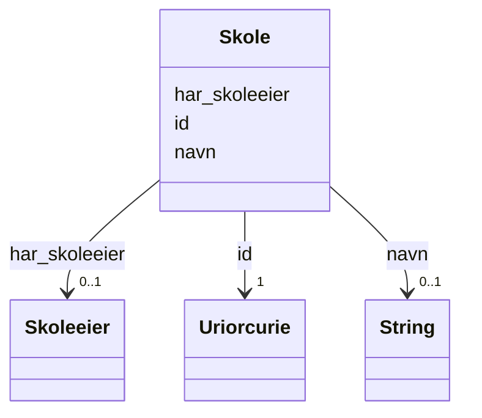

# Class: Skole 


_En skole er en privat eller offentlig institusjon eller et lærested hvor lærere underviser i ulike fag, oftest som grunnlag for videre utdannelse og yrkesliv._


URI: [samtbuskole:Skole](https://example.no/ontology/skole#Skole)





<!-- no inheritance hierarchy -->

## Eigenskapar


  
  

  
  

  
  


  
  

  
  

  
  


  
  

  
  

  
  


  
  
  
  
    
  

  
  
  
  
    
  

  
  
  
  
    
  


### Andre

| Namn | Kardinalitet og domene | Beskriving |
| --- | --- | --- |
| [id](id.md) | 1 <br/> [xsd:anyURI](http://www.w3.org/2001/XMLSchema#anyURI) | URI-identifikator for ressursen |
| [navn](navn.md) | 0..1 <br/> [xsd:string](http://www.w3.org/2001/XMLSchema#string) | Namn på ressursen |
| [har_skoleeier](har_skoleeier.md) | 0..1 <br/> [Skoleeier](skoleeier.md) | Skoleeier for skolen |


## Usages

| used by | used in | type | used |
| ---  | --- | --- | --- |
| [Containerklasse](containerklasse.md) | [skoler](skoler.md) | range | [Skole](skole.md) |
| [Skole](skole.md) | [har_skoleeier](har_skoleeier.md) | domain | [Skole](skole.md) |
| [Basisgruppe](basisgruppe.md) | [del_av_skole](del_av_skole.md) | range | [Skole](skole.md) |
| [Rektor](rektor.md) | [enhetsleder_for](enhetsleder_for.md) | range | [Skole](skole.md) |
| [Kontaktlaerer](kontaktlaerer.md) | [jobber_paa_skole](jobber_paa_skole.md) | range | [Skole](skole.md) |


## See Also

* [https://data.norge.no/concepts/fc9d0dda-71a2-3925-8688-52f849cf0f49](https://data.norge.no/concepts/fc9d0dda-71a2-3925-8688-52f849cf0f49)


## Identifier and Mapping Information


### Schema Source


* from schema: https://example.no/ontology/samt-bu-skole


## Mappings

| Mapping Type | Mapped Value |
| ---  | ---  |
| self | samtbuskole:Skole |
| native | samtbuskole:Skole |
| exact | org:OrganizationalUnit, schema:EducationalOrganization |


## LinkML Source

<!-- TODO: investigate https://stackoverflow.com/questions/37606292/how-to-create-tabbed-code-blocks-in-mkdocs-or-sphinx -->

### Direct

<details>
```yaml
name: Skole
description: En skole er en privat eller offentlig institusjon eller et lærested hvor
  lærere underviser i ulike fag, oftest som grunnlag for videre utdannelse og yrkesliv.
from_schema: https://example.no/ontology/samt-bu-skole
see_also:
- https://data.norge.no/concepts/fc9d0dda-71a2-3925-8688-52f849cf0f49
exact_mappings:
- org:OrganizationalUnit
- schema:EducationalOrganization
rank: 1000
slots:
- id
- navn
- har_skoleeier

```
</details>

### Induced

<details>
```yaml
name: Skole
description: En skole er en privat eller offentlig institusjon eller et lærested hvor
  lærere underviser i ulike fag, oftest som grunnlag for videre utdannelse og yrkesliv.
from_schema: https://example.no/ontology/samt-bu-skole
see_also:
- https://data.norge.no/concepts/fc9d0dda-71a2-3925-8688-52f849cf0f49
exact_mappings:
- org:OrganizationalUnit
- schema:EducationalOrganization
rank: 1000
attributes:
  id:
    name: id
    description: URI-identifikator for ressursen.
    from_schema: https://data.norge.no/linkml/common-ap-no
    identifier: true
    alias: id
    owner: Skole
    domain_of:
    - KatalogisertRessurs
    - Aktor
    - Kontaktopplysning
    - Tidsrom
    - RegulativRessurs
    - Identifikator
    - Rettighetserklaring
    - Sjekksum
    - Gebyr
    - Relasjon
    - Distribusjon
    - Datasett
    - Katalogpost
    - Mediatype
    - Konsept
    - Begrepssamling
    - Kvalitetsdimensjon
    - Kvalitetsmaal
    - Kvalitetsmerknad
    - Kvalitetsmaaling
    - Standard
    - Tekstdel
    - Containerklasse
    - Skole
    - Skoleeier
    - Basisgruppe
    - Person
    range: uriorcurie
    required: true
  navn:
    name: navn
    description: Namn på ressursen.
    from_schema: https://example.no/ontology/samt-bu-skole
    rank: 1000
    alias: navn
    owner: Skole
    domain_of:
    - Skole
    - Skoleeier
    - Basisgruppe
    - Person
    range: string
  har_skoleeier:
    name: har_skoleeier
    description: Skoleeier for skolen
    from_schema: https://example.no/ontology/samt-bu-skole
    exact_mappings:
    - org:hasUnit
    rank: 1000
    domain: Skole
    alias: har_skoleeier
    owner: Skole
    domain_of:
    - Skole
    range: Skoleeier

```
</details>