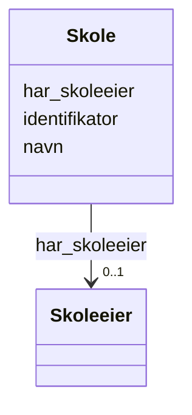

# Class: Skole 


_En skole er en privat eller offentlig institusjon eller et lærested hvor lærere underviser i ulike fag, oftest som grunnlag for videre utdannelse og yrkesliv._


URI: [samtbuskole:Skole](https://example.no/ontology/skole#Skole)





<!-- no inheritance hierarchy -->

## Eigenskapar


  
  

  
  

  
  


  
  

  
  

  
  


  
  

  
  

  
  


  
  
  
  
    
  

  
  
  
  
    
  

  
  
  
  
    
  


### Andre

| Namn | Kardinalitet og domene | Beskriving |
| --- | --- | --- |
| [identifikator](identifikator.md) | 1 <br/> [Uriorcurie](uriorcurie.md) | Global identifikator (CURIE/URI) |
| [navn](navn.md) | 0..1 <br/> [String](string.md) | Namn på ressursen |
| [har_skoleeier](har_skoleeier.md) | 0..1 <br/> [Skoleeier](skoleeier.md) | Skoleeier for skolen |


## Usages

| used by | used in | type | used |
| ---  | --- | --- | --- |
| [Containerklasse](containerklasse.md) | [skoler](skoler.md) | range | [Skole](skole.md) |
| [Skole](skole.md) | [har_skoleeier](har_skoleeier.md) | domain | [Skole](skole.md) |
| [Basisgruppe](basisgruppe.md) | [del_av_skole](del_av_skole.md) | range | [Skole](skole.md) |
| [Rektor](rektor.md) | [enhetsleder_for](enhetsleder_for.md) | range | [Skole](skole.md) |
| [Kontaktlaerer](kontaktlaerer.md) | [jobber_paa_skole](jobber_paa_skole.md) | range | [Skole](skole.md) |


## Identifier and Mapping Information


### Schema Source


* from schema: https://example.no/ontology/samt-bu-skole


## Mappings

| Mapping Type | Mapped Value |
| ---  | ---  |
| self | samtbuskole:Skole |
| native | samtbuskole:Skole |
| exact | org:OrganizationalUnit, schema:EducationalOrganization |


## LinkML Source

<!-- TODO: investigate https://stackoverflow.com/questions/37606292/how-to-create-tabbed-code-blocks-in-mkdocs-or-sphinx -->

### Direct

<details>
```yaml
name: Skole
description: En skole er en privat eller offentlig institusjon eller et lærested hvor
  lærere underviser i ulike fag, oftest som grunnlag for videre utdannelse og yrkesliv.
from_schema: https://example.no/ontology/samt-bu-skole
exact_mappings:
- org:OrganizationalUnit
- schema:EducationalOrganization
slots:
- identifikator
- navn
- har_skoleeier

```
</details>

### Induced

<details>
```yaml
name: Skole
description: En skole er en privat eller offentlig institusjon eller et lærested hvor
  lærere underviser i ulike fag, oftest som grunnlag for videre utdannelse og yrkesliv.
from_schema: https://example.no/ontology/samt-bu-skole
exact_mappings:
- org:OrganizationalUnit
- schema:EducationalOrganization
attributes:
  identifikator:
    name: identifikator
    description: Global identifikator (CURIE/URI).
    from_schema: https://example.no/ontology/samt-bu-skole
    rank: 1000
    identifier: true
    alias: identifikator
    owner: Skole
    domain_of:
    - Containerklasse
    - Skole
    - Skoleeier
    - Basisgruppe
    - Person
    range: uriorcurie
    required: true
  navn:
    name: navn
    description: Namn på ressursen.
    from_schema: https://example.no/ontology/samt-bu-skole
    rank: 1000
    alias: navn
    owner: Skole
    domain_of:
    - Skole
    - Skoleeier
    - Basisgruppe
    - Person
    range: string
  har_skoleeier:
    name: har_skoleeier
    description: Skoleeier for skolen
    from_schema: https://example.no/ontology/samt-bu-skole
    exact_mappings:
    - org:hasUnit
    rank: 1000
    domain: Skole
    alias: har_skoleeier
    owner: Skole
    domain_of:
    - Skole
    range: Skoleeier

```
</details>