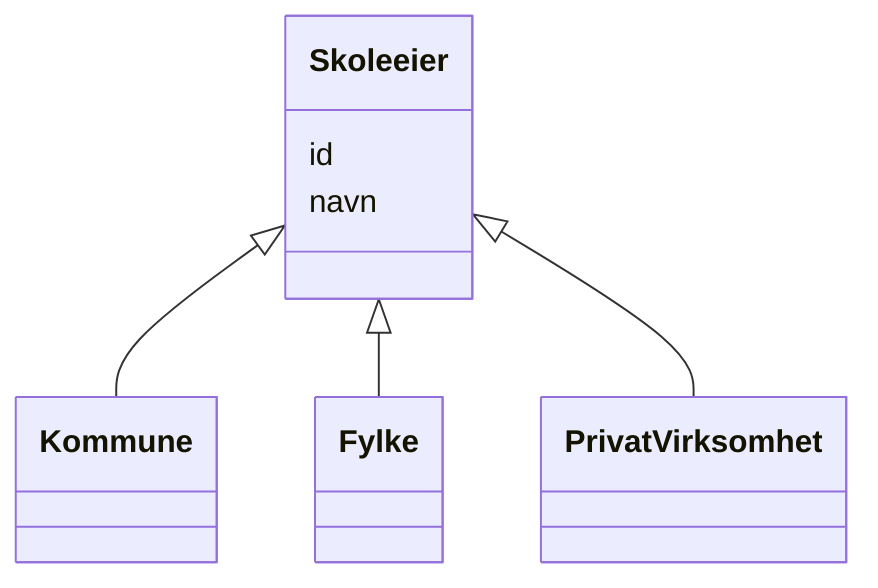

# Class: Skoleeier 


_Superklasse for alle typer skoleeiere._


* __NOTE__: this is an abstract class and should not be instantiated directly


URI: [samtbuskole:Skoleeier](https://example.no/ontology/skole#Skoleeier)





## Inheritance
* **Skoleeier**
    * [Kommune](kommune.md)
    * [Fylke](fylke.md)
    * [PrivatVirksomhet](privatvirksomhet.md)


## Eigenskapar


  
  

  
  


  
  

  
  


  
  

  
  


  
  
  
  
    
  

  
  
  
  
    
  


### Andre

| Namn | Kardinalitet og domene | Beskriving |
| --- | --- | --- |
| [id](id.md) | 1 <br/> [Uriorcurie](uriorcurie.md) | URI-identifikator for ressursen |
| [navn](navn.md) | 0..1 <br/> [String](string.md) | Namn på ressursen |


## Usages

| used by | used in | type | used |
| ---  | --- | --- | --- |
| [Skole](skole.md) | [har_skoleeier](har_skoleeier.md) | range | [Skoleeier](skoleeier.md) |


## Identifier and Mapping Information


### Schema Source


* from schema: https://example.no/ontology/samt-bu-skole


## Mappings

| Mapping Type | Mapped Value |
| ---  | ---  |
| self | samtbuskole:Skoleeier |
| native | samtbuskole:Skoleeier |
| exact | foaf:Agent |


## LinkML Source

<!-- TODO: investigate https://stackoverflow.com/questions/37606292/how-to-create-tabbed-code-blocks-in-mkdocs-or-sphinx -->

### Direct

<details>
```yaml
name: Skoleeier
description: Superklasse for alle typer skoleeiere.
from_schema: https://example.no/ontology/samt-bu-skole
exact_mappings:
- foaf:Agent
abstract: true
slots:
- id
- navn

```
</details>

### Induced

<details>
```yaml
name: Skoleeier
description: Superklasse for alle typer skoleeiere.
from_schema: https://example.no/ontology/samt-bu-skole
exact_mappings:
- foaf:Agent
abstract: true
attributes:
  id:
    name: id
    description: URI-identifikator for ressursen.
    from_schema: https://example.no/ontology/samt-bu-skole
    rank: 1000
    identifier: true
    alias: id
    owner: Skoleeier
    domain_of:
    - Containerklasse
    - Skole
    - Skoleeier
    - Basisgruppe
    - Person
    - KatalogisertRessurs
    - Aktor
    - Kontaktopplysning
    - Tidsrom
    - RegulativRessurs
    - Identifikator
    - Rettighetserklaring
    - Sjekksum
    - Gebyr
    - Relasjon
    - Distribusjon
    - Datasett
    - Katalogpost
    - Mediatype
    - Konsept
    - Begrepssamling
    - Kvalitetsdimensjon
    - Kvalitetsmaal
    - Kvalitetsmerknad
    - Kvalitetsmaaling
    - Standard
    - Tekstdel
    range: uriorcurie
    required: true
  navn:
    name: navn
    description: Namn på ressursen.
    from_schema: https://example.no/ontology/samt-bu-skole
    rank: 1000
    alias: navn
    owner: Skoleeier
    domain_of:
    - Skole
    - Skoleeier
    - Basisgruppe
    - Person
    range: string

```
</details>