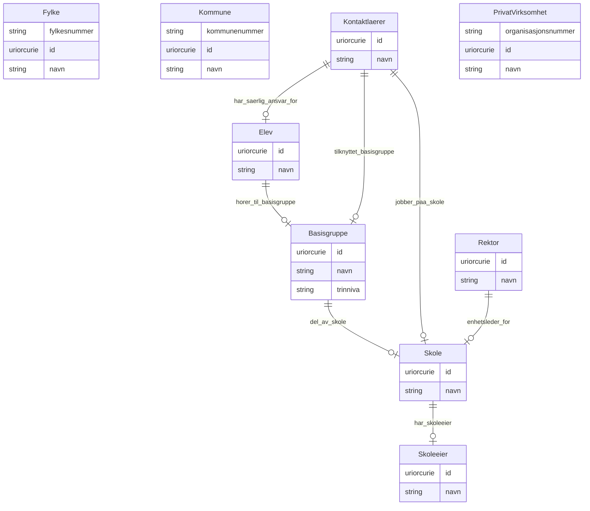

```mermaid
erDiagram
Basisgruppe {
    uriorcurie id  
    string navn  
    string trinniva  
}
Elev {
    uriorcurie id  
    string navn  
}
Fylke {
    string fylkesnummer  
    uriorcurie id  
    string navn  
}
Kommune {
    string kommunenummer  
    uriorcurie id  
    string navn  
}
Kontaktlaerer {
    uriorcurie id  
    string navn  
}
PrivatVirksomhet {
    string organisasjonsnummer  
    uriorcurie id  
    string navn  
}
Rektor {
    uriorcurie id  
    string navn  
}
Skole {
    uriorcurie id  
    string navn  
}
Skoleeier {
    uriorcurie id  
    string navn  
}

Basisgruppe ||--|o Skole : "del_av_skole"
Elev ||--|o Basisgruppe : "horer_til_basisgruppe"
Kontaktlaerer ||--|o Basisgruppe : "tilknyttet_basisgruppe"
Kontaktlaerer ||--|o Elev : "har_saerlig_ansvar_for"
Kontaktlaerer ||--|o Skole : "jobber_paa_skole"
Rektor ||--|o Skole : "enhetsleder_for"
Skole ||--|o Skoleeier : "har_skoleeier"


```
