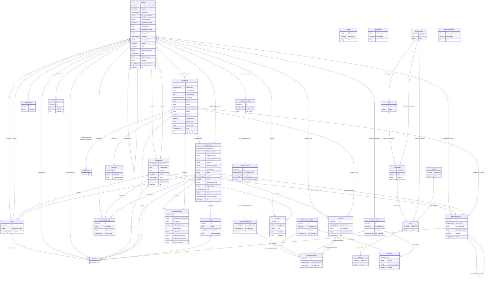

```mermaid
erDiagram
Aktor {
    uriorcurie id  
    string identifikator_literal  
    LangStringList navn_aktor  
}
Basisgruppe {
    uriorcurie identifikator  
    string navn  
    string trinniva  
}
Brukartilbakemelding {
    uriorcurie id  
    uriorcurie er_motivert_av  
    uri har_maal  
    LangStringList har_merknad  
}

Datasett {
    stringList annen_ansvarlig_aktor  
    stringList begrep  
    LangStringList beskrivelse  
    uriList ble_generert_ved  
    uriList dokumentasjon  
    stringList eierskapshistorikk  
    date endringsdato  
    string identifikator_literal  
    uriList landingsside  
    LangStringList nokkelord  
    uriList relatert_ressurs  
    stringList spraak  
    stringList tema  
    uriList tilgangsrettigheter  
    LangStringList tittel  
    date utgivelsesdato  
    string versjon  
    LangStringList versjonsmerknad  
    uriorcurie id  
}
Datasettserie {
    LangStringList beskrivelse  
    date endringsdato  
    string frekvens  
    stringList tema  
    LangStringList tittel  
    date utgivelsesdato  
    uriorcurie id  
}
Datatjeneste {
    LangStringList beskrivelse  
    uriList dokumentasjon  
    uriList endepunkts_url  
    uriList endepunktsbeskrivelse  
    string format  
    string identifikator_literal  
    uriList landingsside  
    string lisens  
    LangStringList nokkelord  
    stringList tema  
    uriList tilgangsrettigheter  
    string tilgjengelighet  
    LangStringList tittel  
    string versjon  
    LangStringList versjonsmerknad  
    uriorcurie id  
}
Distribusjon {
    uriorcurie id  
    LangStringList beskrivelse  
    uriList dokumentasjon  
    date endringsdato  
    NonNegativeInteger filstorrelse  
    string format  
    string lisens  
    uriList nedlastningslenke  
    string policy  
    stringList spraak  
    Duration tidsopplosning  
    uriList tilgangs_url  
    string tilgjengelighet  
    LangStringList tittel  
    date utgivelsesdato  
}
Elev {
    uriorcurie identifikator  
    string navn  
}
Fylke {
    string fylkesnummer  
    uriorcurie identifikator  
    string navn  
}
Gebyr {
    uriorcurie id  
    string belop  
    LangStringList beskrivelse  
    uriList dokumentasjon  
}
Identifikator {
    uriorcurie id  
    string notasjon  
}
Kommune {
    string kommunenummer  
    uriorcurie identifikator  
    string navn  
}
Konsept {
    uriorcurie id  
}
Kontaktlaerer {
    uriorcurie identifikator  
    string navn  
}
Kontaktopplysning {
    uriorcurie id  
    string har_epost  
    string har_kontaktside  
    LangStringList navn_vcard  
}
Kvalitetsdeldimensjon {
    LangStringList har_anbefalt_term  
    LangStringList har_definisjon  
    uriorcurie id  
}
Kvalitetsdimensjon {
    uriorcurie id  
    LangStringList har_anbefalt_term  
    LangStringList har_definisjon  
}
Kvalitetsmaal {
    uriorcurie id  
    LangStringList har_anbefalt_term  
    LangStringList har_definisjon  
    uriorcurie har_forventet_datatype  
}
Kvalitetsmaaling {
    uriorcurie id  
    LangStringList har_merknad  
    string har_verdi  
}
Kvalitetsmerknad {
    uriorcurie id  
    uriorcurie er_motivert_av  
    uri har_maal  
    LangStringList har_merknad  
}
Mediatype {
    uriorcurie id  
}
PrivatVirksomhet {
    string organisasjonsnummer  
    uriorcurie identifikator  
    string navn  
}
RegulativRessurs {
    uriorcurie id  
    LangStringList beskrivelse  
    uriList har_referanse  
    string identifikator_literal  
    stringList spraak  
    LangStringList tittel  
}
Rektor {
    uriorcurie identifikator  
    string navn  
}
Relasjon {
    uriorcurie id  
    string har_rolle  
    uri relasjon_til  
}
Rettighetserklaring {
    uriorcurie id  
    string anvendelsesretningslinjer  
    string jurisdiksjon  
    string krediteringstekst  
    uri krediteringsurl  
    GYear opphavsrettsaar  
    string opphavsrettserklaring  
    string opphavsrettsinnehaver  
    string opphavsrettsnotis  
}
Sjekksum {
    uriorcurie id  
    string algoritme  
    string sjekksumverdi  
}
Skole {
    uriorcurie identifikator  
    string navn  
}
Skoleeier {
    uriorcurie identifikator  
    string navn  
}
Standard {
    uriorcurie id  
    LangStringList har_merknad  
    uriList har_referanse  
    string har_versjonsnummer  
    LangStringList tittel  
}
Tekstdel {
    uriorcurie id  
    string format  
    string har_verdi_tekstdel  
    stringList spraak  
}
Tidsrom {
    uriorcurie id  
    datetime begynnelse  
    datetime slutt  
    date sluttdato  
    date startdato  
}

Aktor ||--|o Konsept : "type_concept"
Basisgruppe ||--|o Skole : "del_av_skole"
Brukartilbakemelding ||--|o Tekstdel : "har_tekstdel"
Brukartilbakemelding ||--}o Kvalitetsdimensjon : "er_i_kvalitetsdimensjon"
Datasett ||--|o Aktor : "produsent"
Datasett ||--|o Konsept : "type_concept"
Datasett ||--|| Aktor : "utgiver"
Datasett ||--}o Datasett : "kilde_datasett"
Datasett ||--}o Datasettserie : "i_serie"
Datasett ||--}o Distribusjon : "datasettdistribusjon, eksempeldata"
Datasett ||--}o Identifikator : "annen_identifikator"
Datasett ||--}o Konsept : "dekningsomraade"
Datasett ||--}o Kvalitetsmaaling : "har_kvalitetsmaaling"
Datasett ||--}o Kvalitetsmerknad : "har_kvalitetsmerknad"
Datasett ||--}o RegulativRessurs : "gjeldende_lovgivning"
Datasett ||--}o Relasjon : "annen_spesifikk_relasjon"
Datasett ||--}o Standard : "i_samsvar_med"
Datasett ||--}o Tidsrom : "tidsrom"
Datasett ||--}| Kontaktopplysning : "kontaktpunkt"
Datasettserie ||--|o Datasett : "forste, siste"
Datasettserie ||--|| Aktor : "utgiver"
Datasettserie ||--}o Konsept : "dekningsomraade"
Datasettserie ||--}o RegulativRessurs : "gjeldende_lovgivning"
Datasettserie ||--}o Tidsrom : "tidsrom"
Datasettserie ||--}| Kontaktopplysning : "kontaktpunkt"
Datatjeneste ||--|o Konsept : "status"
Datatjeneste ||--|o Rettighetserklaring : "rettigheter"
Datatjeneste ||--|| Aktor : "utgiver"
Datatjeneste ||--}o Datasett : "tilgjengeliggjor_datasett"
Datatjeneste ||--}o Gebyr : "har_gebyr"
Datatjeneste ||--}o RegulativRessurs : "gjeldende_lovgivning"
Datatjeneste ||--}o Standard : "i_samsvar_med"
Datatjeneste ||--}| Kontaktopplysning : "kontaktpunkt"
Distribusjon ||--|o Konsept : "status"
Distribusjon ||--|o Mediatype : "komprimeringsformat, medietype, pakkeformat"
Distribusjon ||--|o Rettighetserklaring : "rettigheter"
Distribusjon ||--|o Sjekksum : "sjekksum"
Distribusjon ||--}o Datatjeneste : "tilgangstjeneste"
Distribusjon ||--}o RegulativRessurs : "gjeldende_lovgivning"
Distribusjon ||--}o Standard : "i_samsvar_med"
Elev ||--|o Basisgruppe : "horer_til_basisgruppe"
Gebyr ||--|o Konsept : "valuta"
Kontaktlaerer ||--|o Basisgruppe : "tilknyttet_basisgruppe"
Kontaktlaerer ||--|o Elev : "har_saerlig_ansvar_for"
Kontaktlaerer ||--|o Skole : "jobber_paa_skole"
Kvalitetsdeldimensjon ||--|| Kvalitetsdimensjon : "er_deldimensjon_av"
Kvalitetsmaal ||--|| Kvalitetsdeldimensjon : "er_i_kvalitetsdeldimensjon"
Kvalitetsmaaling ||--|| Kvalitetsmaal : "er_kvalitetsmaaling_av"
Kvalitetsmerknad ||--|o Tekstdel : "har_tekstdel"
Kvalitetsmerknad ||--}o Kvalitetsdimensjon : "er_i_kvalitetsdimensjon"
RegulativRessurs ||--|o Konsept : "type_concept"
RegulativRessurs ||--}o RegulativRessurs : "relatert_regulativ_ressurs"
Rektor ||--|o Skole : "enhetsleder_for"
Skole ||--|o Skoleeier : "har_skoleeier"
Standard ||--}o Kvalitetsdimensjon : "er_i_kvalitetsdimensjon"

```

