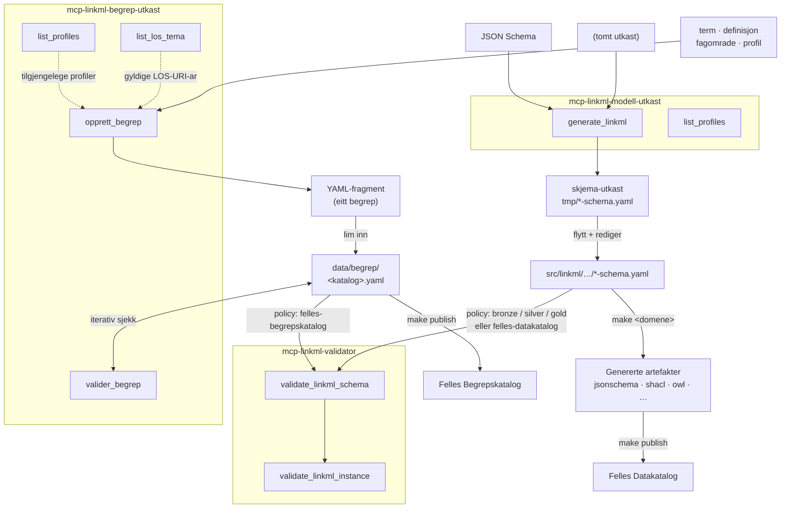

# Evaluering: Namngjeving av MCP-serverane

## Noverande tilstand

| Server (mappe/image) | Make-prefiks | MCP-verktøy | Funksjon |
|---|---|---|---|
| `mcp-linkml-validator` | `mcp-val-*` / `mcp-validate` | `validate_linkml_schema`, `validate_linkml_instance` | Policy-basert validering av LinkML-skjema og instansar |
| `mcp-linkml-generator` | `mcp-gen-*` / `mcp-generate` | `generate_linkml`, `list_profiles` | Lagar førsteutkast av LinkML-skjema frå JSON Schema eller tomt |
| `mcp-linkml-begrep-generator` | `mcp-begrep-*` | `opprett_begrep`, `valider_begrep`, `list_profiles`, `list_los_tema` | Genererer eitt begrep-fragment av gongen til innsetting i datafil |

---

## Problem med noverande namngjeving

### `mcp-linkml-generator` er tvetydig

Namnet høyrest ut som ein server som *genererer artefakter frå* LinkML — det `gen-jsonschema`, `gen-owl`, `gen-shacl` gjer. Men serveren lagar eit *førsteutkast av eit skjema* — anten frå JSON Schema eller frå botn. Ein AI-assistent eller ny brukar vil naturleg forveksle det med gen-verktøya.

### `mcp-linkml-begrep-generator` er inkonsistent

`begrep` er skuva inn mellom `linkml` og `generator` — eit anna mønster enn dei to andre serverane. I tillegg skjuler `-generator`-suffikset at serveren òg validerer (`valider_begrep`).

---

## Tilråding

| Før | Etter | Grunngiving |
|---|---|---|
| `mcp-linkml-validator` | uendra | Klar og korrekt |
| `mcp-linkml-generator` | `mcp-linkml-modell-utkast` | Eintydig: lagar eit modell-utkast (struktur), ikkje artefakter frå LinkML |
| `mcp-linkml-begrep-generator` | `mcp-linkml-begrep-utkast` | Eintydig: lagar begrep-fragment (innhald) til innsetting i datafil |

Distinksjonen mellom dei to utkast-serverane:

- **`modell-utkast`** lagar ein *ny skjemastruktur* — klassar, slots og URI-ar som krev manuell redigering etterpå. Kvar modell er unik.
- **`begrep-utkast`** lagar *innhald til ein fast modell* (SKOS-AP-NO-Begrep). Strukturen er alltid den same; det som varierer er termar, definisjonar og metadata. Outputen er eit fragment som limast inn i ei eksisterande datafil og deretter validerast med `valider_begrep`.

---

## Arbeidsflyt

Støtteverktøya `list_profiles` og `list_los_tema` vert brukte interaktivt (av ein AI-assistent
eller direkte) for å slå opp gyldige verdiar *før* ein kallar `opprett_begrep`. `valider_begrep`
er ein iterativ skjemasjekk under utfylling — den fulle policy-valideringa køyrer mot
`mcp-linkml-validator`.

---

## Kva må endrast

| Kva | Endring |
|---|---|
| Mappenamn `src/mcp-linkml-generator/` | → `src/mcp-linkml-modell-utkast/` |
| Mappenamn `src/mcp-linkml-begrep-generator/` | → `src/mcp-linkml-begrep-utkast/` |
| Makefile-variablar og -target (`mcp-gen-*` → `mcp-mod-*`, `mcp-begrep-*` uendra) | Minimale endringar |
| Image-namn i `release.yml` / `generate.yml` | `mcp-linkml-generator` → `mcp-linkml-modell-utkast`, `mcp-linkml-begrep-generator` → `mcp-linkml-begrep-utkast` |
| MCP-verktøynamn `generate_linkml` | → `draft_linkml_schema` (valfritt) |
| README-filer, `CLAUDE.md` og `specs/`-referansar | Tekstleg oppdatering |

MCP-verktøynamnet `generate_linkml` kan behaldast for no — det er eit internt API-namn som ikkje er synleg i mappestrukturen eller Makefile-target.

---

## Dokumentasjon som må skrivast

Namneendringa bør følgjast av oppdatert brukarrettleiing for `mcp-linkml-begrep-utkast`.
Det manglar i dag ein stad som viser korleis ein faktisk gir termar og definisjonar til
serveren på ein brukarvennleg måte — særleg for AI-assistert arbeidsflyt.

Konkret bør README for `mcp-linkml-begrep-utkast` innehalde eit avsnitt med:

- Tilrådd klartekstformat for å gi éin eller fleire begrep til Claude
- Kva Claude utleier automatisk (slug frå term, LOS-URI frå `list_los_tema`, standardverdiar frå profil)
- Kva brukaren alltid må oppgi eksplisitt (anbefalt term, definisjon, fagområde)
- Eksempel med éin og fleire begrep, med og utan kjeldereferanse

---

## Avgrensing

Namneendringa er eit reint organisatorisk tiltak. Ho krev ingen endringar i:
- LinkML-skjema
- Policy-filer
- Genererte artefakter
- GitHub Pages-dokumentasjonen (utanom referansar i tekst)
